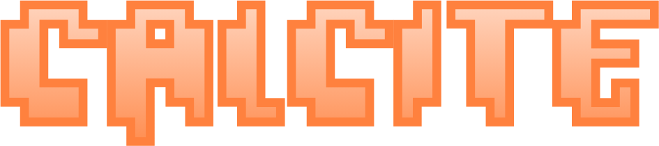

  

---

A simple mod loader for Geometry Dash's web port.

## Usage

Mods are written in JavaScript and have access to `window.gdGame` (the
`Phaser.Game` object) and `window.gdScene` (the main `Phaser.Scene` object).

Mods can optionally contain a header comment to dictate the naming and other
metadata about mods, otherwise mods will be added with the name "Untitled mod".

Uploading a mod with the same file name as a pre-existing mod will update the
contents of the mod.

## Roadmap

- [ ] Actions menu (for if a mod is completely breaking the site)
- [ ] Updating
  - [ ] Mod versioning
  - [ ] Auto update
- [ ] Dependencies
- [ ] Library-like APIs
- [ ] Userscript build tartet
- [ ] More event hooks (e.g. `onStart`)
- [ ] Make patcher auto-extract required function names (and offset)
- [x] Broaden patcher method matching
- [ ] Mod dev auto reload

---

## Disclaimer

This project is not affiliated with RobTop Games or Geometry Dash. This is a
community project containing none of the original code.
